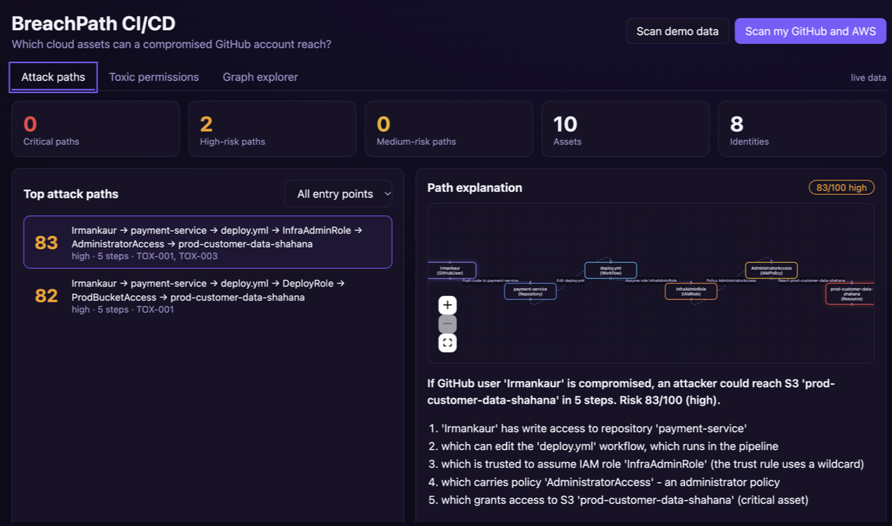
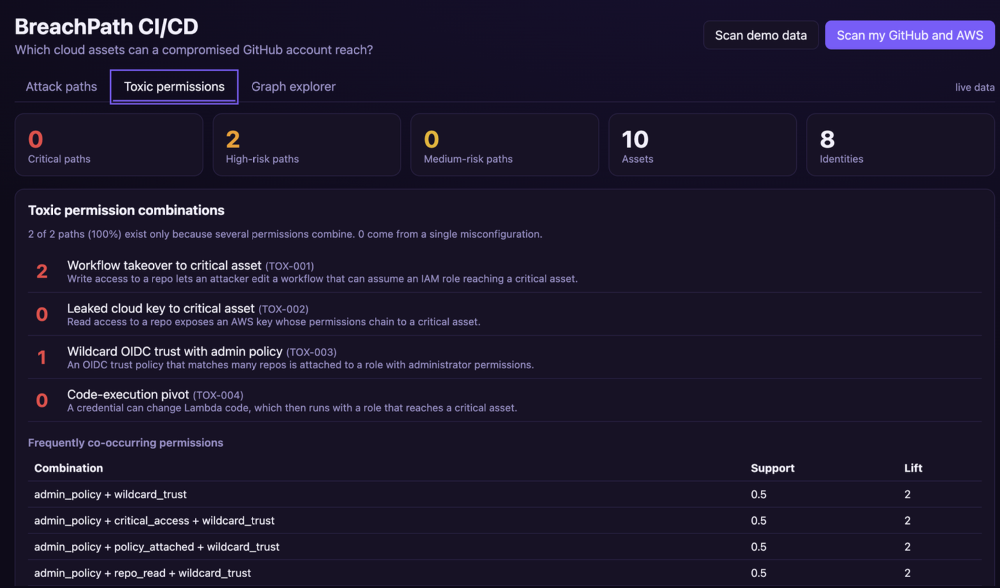
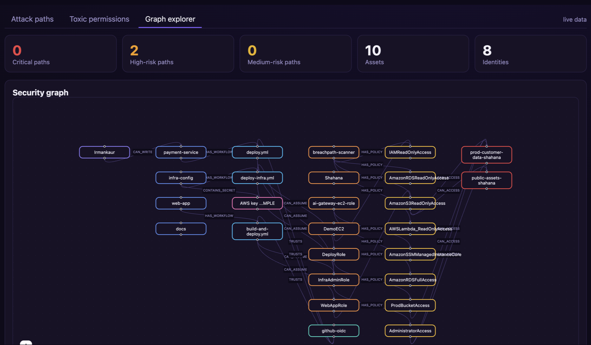

# BreachPath CI/CD

**Explainable graph-based attack path analysis for GitHub-to-AWS environments.**

If a GitHub account is compromised, which cloud assets can an attacker reach? BreachPath answers that by joining GitHub permissions and AWS IAM trust into a single graph, finding every route from a person to a critical asset, scoring each route, and explaining it in plain English.



## Why this exists

Teams deploy to AWS through GitHub Actions, which means AWS has to trust GitHub (OIDC federation). That trust forms a chain:

```
person → repository → workflow → IAM role → policy → cloud resource
```

Each link looks harmless on its own. Chained together, they can let a low-privilege account, such as a read-only intern with a leaked key in a repo, reach a production database. Existing tools either check one system at a time or draw complex graphs only security engineers can read. BreachPath analyzes the whole chain across GitHub and AWS and explains the result for developers, managers and auditors.

## Features

- **Cross-platform graph.** Collects GitHub users, teams, repositories, workflows and exposed AWS keys, plus AWS IAM roles, users, policies, S3, RDS and Lambda, and links them into one typed property graph (10 node types, 11 relationship types).
- **OIDC trust modelling.** Parses IAM trust policies and workflow YAML to work out which workflows can assume which roles, and how strict each trust rule is (wildcard, any branch, branch-pinned, environment-protected, or no condition).
- **Leaked key detection.** Finds AWS access key IDs in repository files and links them to the IAM users that own them.
- **Attack path discovery.** Top-k lowest-cost paths from every GitHub user to every critical asset, with permission-semantics checks (for example, a read-only user cannot edit a workflow).
- **Risk scoring.** A transparent 0–100 score built from five factors, mapped to critical, high, medium and low.
- **Toxic permission detection.** Four named rules plus frequent-combination mining (support and lift) for permissions that are only dangerous together.
- **Plain-English explanations.** Numbered steps, a simplified flow diagram and fix suggestions for every path. Rule-based by default, with an optional LLM rewrite.
- **React dashboard.** Attack paths, toxic permissions and a graph explorer.

| Toxic permissions | Graph explorer |
|---|---|
|  |  |

## How it works

```
GitHub collector ─┐
                  ├─ normalize ─ graph (NetworkX) ─ analysis engine ─ explainer ─ FastAPI ─ React dashboard
AWS collector ────┘                  │
                                     └─ optional sync to Neo4j
```

1. **Collect.** Read-only calls to the GitHub REST API and to AWS through boto3.
2. **Normalize.** Create the links neither platform can see alone: workflow → role (through OIDC trust), secret → IAM user, and principal → role.
3. **Build the graph.** Every relationship carries three numbers: exploitability (0–1), privilege level (1–5) and permission sensitivity (0–1).
4. **Find paths.** Edge cost is `0.1 + (−ln exploitability)`. Attack success is the product of per-step probabilities, and taking the negative log turns that product into a sum, so Dijkstra-based shortest path finds the most likely route. Yen's algorithm returns the top 3 loop-free paths per user and asset, and a validity filter removes routes that break permission rules. A breadth-first search gives the blast-radius overview.
5. **Score and tag.** Each path is scored, tagged with the capabilities it uses, and matched against the toxic rules.
6. **Explain and serve.** Paths become narratives and flow diagrams, exposed through FastAPI to the dashboard.

### Critical assets

A resource is critical when its criticality is 7 or more. Criticality is 9 when the resource name contains one of `prod`, `production`, `payment` or `backup`, otherwise 3. A tag `breachpath:criticality` on the resource overrides this, and the keywords are configurable.

### Risk score

| Factor | Weight | Meaning |
|---|---|---|
| Asset criticality | 30% | Value of the target asset |
| Permission sensitivity | 20% | Average sensitivity of the permissions on the path |
| Privilege escalation | 20% | (highest privilege on the path − first privilege) ÷ 4 |
| Exploitability | 20% | Geometric mean of per-step exploitability |
| Path simplicity | 10% | `1 / (1 + 0.15 × (steps − 1))` |

The final score is 100 × the weighted sum, plus 3 if the path matches a toxic rule, capped at 100.

| Severity | Score |
|---|---|
| Critical | 85 and above |
| High | 65–84 |
| Medium | 40–64 |
| Low | below 40 |

The weights are expert-chosen heuristics, not values calibrated on real incident data. Treat the ranking as the output, not the absolute numbers.

### Toxic permission rules

| Rule | Needs | Meaning |
|---|---|---|
| TOX-001 Workflow takeover | repo write, workflow edit, role assumption, critical access | Write access lets an attacker edit a pipeline that reaches a critical asset |
| TOX-002 Leaked cloud key | repo read, secret exposure, credential use, critical access | A readable key chains to a critical asset |
| TOX-003 Wildcard trust with admin | wildcard OIDC trust, admin policy | A trust rule matching many repos is attached to an administrator role |
| TOX-004 Code-execution pivot | Lambda code change, credential use, critical access | A credential can change Lambda code that runs with a powerful role |

### Example finding

> If GitHub user `dev-user` is compromised, an attacker could reach RDS `prod-database` in 5 steps.
> 1. `dev-user` has write access to repository `payment-service`
> 2. which can edit the `deploy.yml` workflow, which runs in the pipeline
> 3. which is trusted to assume IAM role `DeployRole`
> 4. which carries policy `DeployPolicy`
> 5. which grants access to RDS `prod-database` (critical asset)

## Tech stack

| Layer | Tools |
|---|---|
| Backend | Python, FastAPI, boto3, requests, PyYAML |
| Graph and analysis | NetworkX (Dijkstra, Yen's k-shortest paths, BFS) |
| Frontend | React, React Flow, Vite |
| Optional | Neo4j (graph persistence and Cypher), Anthropic API (LLM explanations) |
| Packaging | Docker, Docker Compose |

## Project structure

```
breachpath/
├── backend/
│   ├── app/
│   │   ├── collectors/
│   │   │   ├── github_collector.py   # repos, collaborators, teams, workflows, leaked keys
│   │   │   ├── aws_collector.py      # IAM roles/users/policies, S3, RDS, Lambda
│   │   │   ├── normalize.py          # OIDC, secret and principal linking
│   │   │   └── mock_data.py          # demo dataset (no credentials needed)
│   │   ├── graph/
│   │   │   ├── builder.py            # NetworkX graph construction
│   │   │   └── neo4j_store.py        # optional Neo4j sync
│   │   ├── analysis/
│   │   │   ├── pathfinder.py         # Yen + Dijkstra, validity rules, BFS
│   │   │   ├── risk.py               # 0–100 scoring
│   │   │   ├── toxic.py              # toxic rules and combination mining
│   │   │   └── engine.py             # orchestrates the analysis
│   │   ├── explain/explainer.py      # plain-English narratives, optional LLM
│   │   ├── schema.py                 # node/edge types and default risk metadata
│   │   ├── config.py                 # settings from .env
│   │   └── main.py                   # FastAPI app
│   ├── tests/test_pipeline.py
│   └── evaluate.py                   # precision/recall against a ground-truth table
├── frontend/                         # React dashboard
├── docker-compose.yml
└── .env.example
```

## Getting started

Requirements: Python 3.12 or newer, Node.js 20 or newer.

### 1. Try it with demo data (no accounts needed)

```bash
git clone https://github.com/YOUR-USERNAME/breachpath.git
cd breachpath/backend
python -m venv .venv
source .venv/bin/activate          # Windows: .venv\Scripts\activate
pip install -r requirements.txt
python -m pytest -q                # 6 tests should pass
uvicorn app.main:app --reload      # API docs at http://localhost:8000/docs
```

In a second terminal:

```bash
cd breachpath/frontend
npm install
npm run dev                        # dashboard at http://localhost:5173
```

Open the dashboard and click **Scan demo data**.

### 2. Scan your own GitHub organization and AWS account

Only run this against organizations and accounts you own or are authorized to assess. A throwaway lab is recommended.

1. Copy the config template into the project root and fill it in:
   ```bash
   cp .env.example .env
   ```
2. Set `GITHUB_TOKEN` and `GITHUB_ORG`. The org value is the name only, for example `my-org`, not a URL.
3. Configure an AWS CLI profile with a read-only user and set `AWS_PROFILE` in `.env`:
   ```bash
   aws configure --profile breachpath
   ```
4. Restart the backend (it reads `.env` at startup), then click **Scan my GitHub and AWS**. Any warnings, such as skipped repos, appear in the scan response.

#### Required permissions

| System | Permission |
|---|---|
| GitHub token (classic) | `repo` and `read:org`. The token owner must be an organization owner so collaborators can be listed |
| AWS read-only user | `IAMReadOnlyAccess`, `AmazonS3ReadOnlyAccess`, `AmazonRDSReadOnlyAccess`, `AWSLambda_ReadOnlyAccess` |

The `repo` scope also permits writes. BreachPath only reads, but use a short-lived token on a lab organization and delete it when you are done.

### Configuration

| Variable | Purpose | Default |
|---|---|---|
| `GITHUB_TOKEN`, `GITHUB_ORG` | Live GitHub scan | empty |
| `AWS_PROFILE`, `AWS_REGION` | Live AWS scan (profile name only, never keys) | empty, `ap-south-1` |
| `CRITICAL_THRESHOLD` | Criticality at which an asset counts as critical | `7` |
| `CRITICAL_KEYWORDS` | Name keywords that mark a resource critical | `prod,production,payment,backup` |
| `NEO4J_URI`, `NEO4J_USER`, `NEO4J_PASSWORD` | Optional graph persistence | empty |
| `ANTHROPIC_API_KEY`, `ANTHROPIC_MODEL` | Optional LLM explanations | empty |

### Optional: Neo4j

Set the `NEO4J_*` variables and each scan syncs the graph. Example query in Neo4j Browser:

```cypher
MATCH p=shortestPath((u:GitHubUser {name:'dev-user'})-[*..8]->(a:Resource))
WHERE a.criticality >= 7
RETURN p
```

### Optional: LLM explanations

Explanations are rule-based by default, which keeps them deterministic and checkable against the graph. If `ANTHROPIC_API_KEY` is set, each path gets an **Explain in plain English** button that rewrites the facts in friendlier language. Only structured graph facts are sent, never tokens, keys or raw data. If the call fails, the rule-based text is shown.

### Docker

```bash
cp .env.example .env
docker compose up --build          # dashboard :80, API :8000, Neo4j Browser :7474
```

Change the default Neo4j password in `docker-compose.yml` before exposing anything beyond your own machine.

## API

| Endpoint | Description |
|---|---|
| `POST /api/scan` | Run a scan. Body: `{"source": "mock" or "live"}` |
| `GET /api/summary` | Counts by severity, totals, scan time and data source |
| `GET /api/paths` | Ranked attack paths. Filters: `entry`, `severity`, `limit` |
| `GET /api/paths/{id}` | One path with explanation, flow and score breakdown |
| `GET /api/toxic` | Toxic rule counts and frequent combinations (support, lift) |
| `GET /api/entry-points` | Per-user path counts and blast-radius estimate |
| `GET /api/graph` | Full graph for the explorer |

Interactive documentation is served at `/docs`.

## Testing and evaluation

- `python -m pytest -q` runs six tests on a known scenario: the workflow takeover is found, a leaked-key route is found, a read-only user cannot use a workflow, unrelated users get no false paths, toxic rules fire, and scores stay sorted and within 0–100.
- `python evaluate.py` compares findings with a hand-written ground-truth table and prints precision, recall and runtime. The ground truth ships for the demo scenario. Extend it with your own lab scenarios.

**Status.** Collectors, graph, pathfinding, scoring, toxic rules, explanations and the dashboard are implemented and have been run against a live GitHub organization and AWS account. A cross-check against BloodHound and a user study on comprehension of the explanations are planned, and no results from them are claimed here.

## Limitations

- Workflow-to-role links assume anyone with write access can edit workflows. Branch protection and environment approvals are only approximated through the exploitability weight.
- Only identity policies are analyzed. Permission boundaries, service control policies, resource policies and policy conditions are not evaluated.
- S3 access is not split into read and write. Any matching S3 action counts as access.
- Secret scanning only finds AWS access key IDs by regex, in a limited number of small text files per repository.
- Risk weights, privilege levels and sensitivities are modelling assumptions and have not been calibrated against real incident data.
- The dashboard has no authentication. Do not expose it publicly, because its findings are sensitive.

## Security and ethics

BreachPath uses read-only access and is meant for assessing environments you own or are authorized to test. Never commit `.env` or any credentials. Findings describe potential paths, not confirmed exploits.

## Roadmap

- Scan history and diffs between scans
- Read and write separation for resource permissions
- Azure and GCP collectors
- Continuous monitoring on repository and policy changes
- Suggested remediations with an approval workflow
- Calibration of risk weights on larger datasets

## Related work

- *SoK: Understanding CI/CD Security: A Comprehensive Review of Architecture, Attacks, and Defenses.* IEEE SecDev 2025. DOI 10.1109/SecDev66745.2025.00017
- Catrambone, J. *Your CI/CD Pipeline is My Attack Path: Graphing GitHub OIDC to Cloud Takeover.* SO-CON 2026, SpecterOps.
- *UNC6426: nx Supply Chain to AWS Admin via OIDC.* Mandiant Threat Intelligence, March 2026.

## Authors

Shahana Suresh, Irman Kaur and T Jayapradha. Built as an Information Security course project at VIT Vellore.
